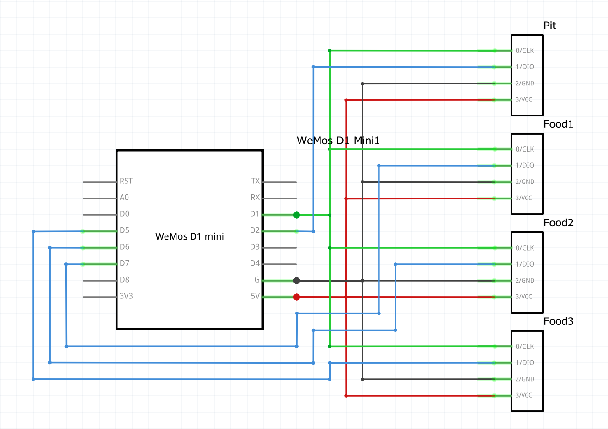

A TM1637-based HeaterMeter client display.

Requires TM1637 and HeaterMeterClient libraries
TM1637 - https://github.com/avishorp/TM1637

Wiring (Wemos D1 Mino -> TM1637):
* 5V -> 5V (all displays)
* GND -> GND (all displays)
* D1 (GPIO5)  -> CLK (all displays)
* D2 (GPIO4)  -> DIO Probe 0 display
* D7 (GPIO13) -> DIO Probe 1 display
* D6 (GPIO12) -> DIO Probe 2 display
* D5 (GPIO14) -> DIO Probe 3 display

## Parts List

* 1x Wemos D1 Mini or any ESP8266 variant with at least 5 usable GPIOs. [Amazon Affiliate Link](https://amzn.to/2ZjXiuq)
* 4x TM1637 7-segment display modules with **decimal** points not "clock" [Amazon Affiliate Link](https://amzn.to/3u6R1jK)

I would recommend searching eBay or Aliexpress for these parts due to the Amazon parts being 30% more expensive than they can be purchased from China.