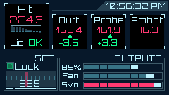

## SMUSHI - Sub-Micro Unusably Small Heatermeter Interface

An unusable ESP32-based HeaterMeter client display.

## Parts List

* 1x LILYGO TTGO T-Display ESP32 board with 1.14" IPS-TFT [Amazon Affiliate Link](https://amzn.to/3klAF2w)

These boards can be bought on Aliexpress for $7 + $6 shipping from the LILYGO official store. Power usage is about 60mA, so a Li-Ion or LiPo battery can be connected using the supplied PH-1.25mm connector and the battery will be charged at 500mA when plugged into USB power.

## Prerequisites (Arduino)

Requires TFT_eSPI and HeaterMeterClient libraries
* TFT_eSPI - https://github.com/Bodmer/TFT_eSPI
* HeaterMeterClient - [in this repository](https://github.com/CapnBry/HeaterMeter/tree/master/arduino/libraries/HeaterMeterClient)

Board settings
* Board type: ESP32 Dev Module
* Upload Speed: 921600
* CPU frequency: 80MHz (for lowest battery use) or 160MHz/240MHz
* Flash frequency: 80MHz
* Flash mode: QIO
* Flash size: 4MB
* Partition scheme: Default 4MB with spiffs
* Core debug level: None
* PSRAM: Disabled

## Uploading

* From the SMUSHI source folder, copy TFT_eSPI/User_Setup.h into the TFT_eSPI library directory, overwriting the existing file
* Edit SMUSHI.ino and set WIFI_SSID, WIFI_PASSWORD to connect to your wifi network
* Set HEATERMEATER_IP to the IP address of your HeaterMeter, or leave blank to use the top result from http://heatermeter.com/devices/
* Set TZ to the time zone string to convert to your local time, or blank to display UTC time
* Upload! Hold the button to the right of the USB connector (S2) to use the wifi credentials you compiled in, otherwise the previous connection information will be used
* The button to the left of the USB connector (S1) flips the display, or hold it down for 1s to enter power down mode (~1mA). Use the reset button to wake again.

